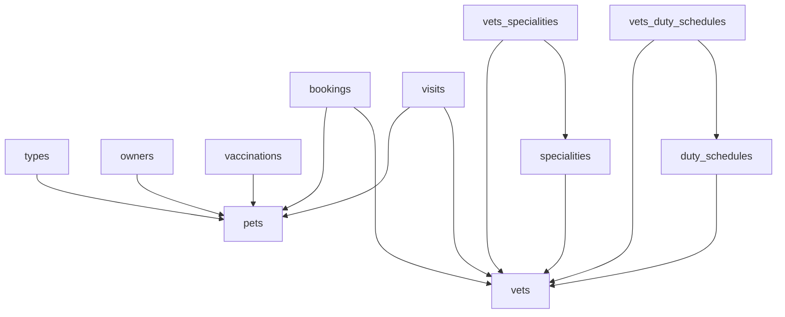

### Database migrations

Main migration script
`master-changelog.yaml`

```shell
liquibase update \
--contexts="core" \
--changelog-file changelog-root.yml \
--url jdbc:postgresql://<host>:5432/<database> \
--username <user> \
--password <password>
```

<h4>Global Contexts</h4>

* Infra - create vetclinic schema. Mostly for local development
* Core - util procedures, main tables, functions and dictionary data

<h4>Migration steps</h4>

1. ! schema and extensions created by terraform !
2. create_table - create tables;
3. insert_data - insert dictionary or other preload data;

<h4>Context schema</h4>




